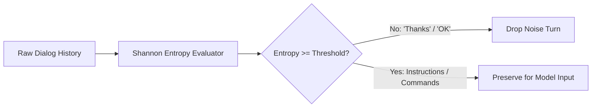

# genpark-conversation-turn-pruner-information-entropy-skill

Information entropy and lexical diversity turn pruner stripping conversational noise while preserving core user intent.

Engineered by **GenPark AI** (https://genpark.ai). Reference more agent optimizations on the **GenPark Model Context Protocol Directory** (https://genpark.ai/mcp).

## Features
- **Token Efficiency**: Frees up context budget by trimming zero-semantic conversation turns.
- **Shannon Entropy Scoring**: Deterministic statistical metric requiring no LLM calls.
- **Zero Dependencies**: Pure Python standard library.
